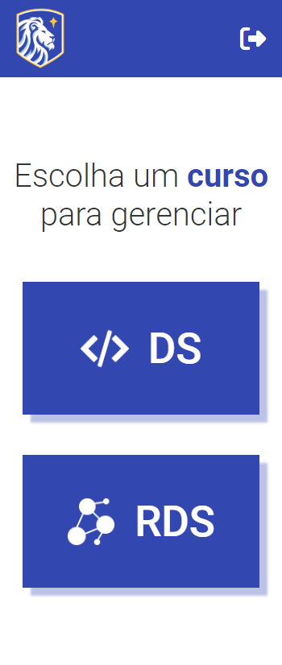
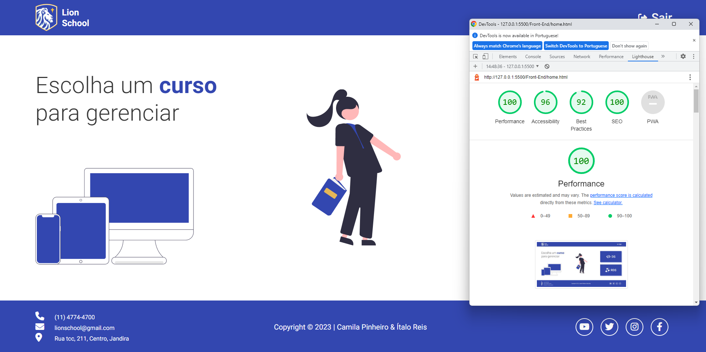

 

<h1><strong>PROJETO INTEGRADO - LION SCHOOL</strong></h1>

|      MOBILE         |          DESKTOP       |
|:-------------------:|:-----------------------:
|||

[Clique aqui]() para acessar o site. 

## **Escopo**

Integrar as disciplinas de PWFE (Programação web Front-end) e PWBE (Programação web Back-end) do curso de Desenvolvimento de Sistemas do SENAI Jandira.

- Neste projeto, cujo objetivo é o gerenciamento do sistema da escola Lion School, desenvolvemos tanto o back-end como o front-end da página.

## **Tecnologias Utilizadas**

- HTML
- CSS
- Markdown
- Responsividade
- JavaScript
- JSON

## **Relatório LightHouse**
O Lighthouse é uma ferramenta automatizada que aprimora a qualidade dos apps da Web, simulando diversas situações que podem afetar a experiência do usuário.

## **Figma**
Utilizando a ferramenta de design Figma, planejamos o breakpoint para smartphones. 
Segue o link: 

- [Link do Figma](https://www.figma.com/file/zecahYY0iLXROChUJgE7iI/PROJETO-INTEGRADO---LION-SCHOOL?node-id=0-1&t=3UjtougSLWNMPcEP-0)

## **Documententação POSTMAN**
O Postman é um API Client que facilita aos desenvolvedores criar, compartilhar, testar e documentar APIs. 
Nossa documentação: 

- [Link do POSTMAN]()

## **Critérios** 
- [x] Criou layout conforme designer feito no Figma?
- [x] Os botões dos cursos são dinâmicos?
- [x] Os cards são criados dinamicamente?
- [x] A página com informações dos cursos foi criada dinamicamente?
- [ ] O filtro por status está funcional?
- [x] Os nomes das variáveis, funções e arquivos tem valor semântico?
- [x] A maioria das funções seguem as boas práticas como responsabilidade única?
- [x] Foi criado o layout responsivo no Figma?
- [x] Foi implementado a responsividade conforme planejado no Figma?
- [ ] Foi criado o filtro por ano?

## **Autores**

| NOMES                                                                                                                                                                                      |                                                     GITHUB                                                      |                                       FOTO                                       |
| :----------------------------------------------------------------------------------------------------------------------------------------------------------------------------------------- | :-------------------------------------------------------------------------------------------------------------: | :------------------------------------------------------------------------------: |
|  |      | </a> |
|  |  | </a> |

